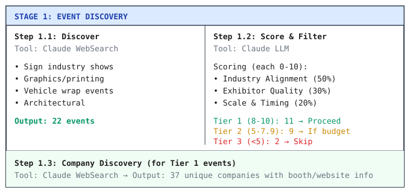
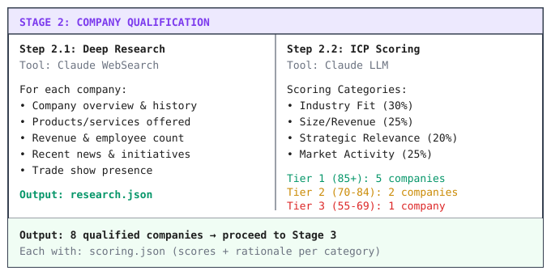
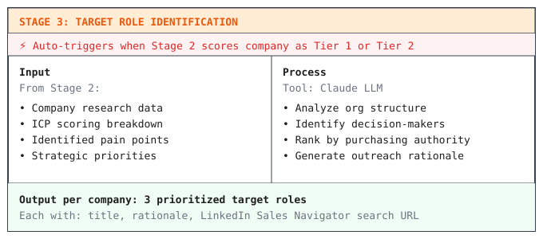
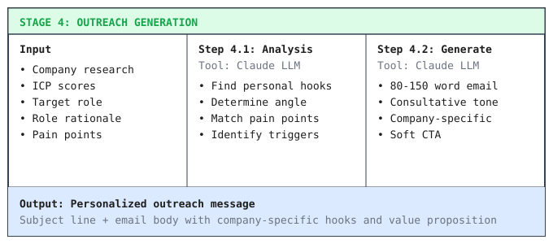

# DuPont Tedlar AI Lead Generation System

## 1. Solution Architecture

The system is a **four-stage AI workflow** that progressively filters and enriches leads:


| Stage | Purpose | Tool | Output |
|-------|---------|------|--------|
| 1. Event Discovery | Find relevant trade shows | Claude WebSearch | 22 events → 11 Tier 1 |
| 2. Company Qualification | Research & score ICP fit | Claude WebSearch | 37 companies → 8 qualified |
| 3. Target Roles | Identify decision-makers | Claude LLM | 3 roles per company |
| 4. Outreach Generation | Personalized messages | Claude LLM | Email/LinkedIn drafts |

### Key Design Decisions

| Decision | Rationale |
|----------|-----------|
| **Event-driven orchestration** | Completing in-progress work is prioritized over starting new. When Stage 2 finishes, Stage 3 automatically triggers. |
| **Tiered qualification** | Scoring with explicit thresholds ensures resources focus on high-potential leads. Low-scoring companies filtered early. |
| **File-based state** | Each stage produces JSON artifacts. Enables resume from interruption without database dependencies. |

---

## 2. Data Processing Pipeline

### 2.1 Stage 1: Event Discovery/

**Objective:** Identify relevant trade shows where potential customers exhibit.



| Tier | Score | Action | Result |
|------|-------|--------|--------|
| Tier 1 | 8-10 | Proceed to company discovery | 11 events |
| Tier 2 | 5-7.9 | Proceed if budget allows | 9 events |
| Tier 3 | <5 | Skip | 2 events |

### 2.2 Stage 2: Company Research & Qualification

**Objective:** Research each company and score their fit against Tedlar's Ideal Customer Profile (ICP).



**Scoring Categories:**

| Category | Weight | Scoring Guidance |
|----------|--------|------------------|
| Industry Fit | 30% | Direct match (signs, wraps, architectural) = 9-10; Adjacent = 6-8 |
| Size/Revenue | 25% | $100M+, 500+ employees = 9-10; $50-100M = 7-8 |
| Strategic Relevance | 20% | Durability focus, outdoor applications = 9-10 |
| Market Activity | 25% | ISA/PRINTING United exhibitor, recent launches = 9-10 |

*Results: 5 Tier 1, 2 Tier 2, 1 Tier 3 companies qualified.*

### 2.3 Stage 3: Target Role Identification

**Objective:** Identify decision-makers to contact at each qualified company.



**Example - Epson America:**

| Priority | Role | Rationale |
|----------|------|-----------|
| 1 | Director of Product Management | Owns solution strategy; controls "print + protect" partnerships |
| 2 | VP of Channel Sales | Manages 100+ resellers who need complete workflow solutions |
| 3 | Director of Marketing | Owns trade show presence and outdoor durability messaging |

### 2.4 Stage 4: Outreach Generation

**Objective:** Generate personalized outreach using all gathered context.



### 2.5 AI Workflow Orchestration

The pipeline is managed by an `main.py`, the main orchestrator that relies on event triggers with:

1. **Priority order:** Later stages processed first—companies closer to completion are finished before starting new ones.
2. **Automatic triggers:** Callbacks connect stages (when Stage 2 completes, Stage 3 starts automatically for qualified companies).
3. **Rate limiting:** Shared limiter tracks API tokens (30k/minute) across all stages.
4. **Resume capability:** File existence checks allow safe restart after interruption.

```python
async def on_company_scored(company, tier, score):
    """When Stage 2 completes, automatically trigger Stage 3"""
    if tier in [1, 2]:  # Only qualified companies proceed
        await process_stage3(company)
```

---

## 3. Implementation Results

### 3.1 Pipeline Metrics

| Stage | Metric | Count |
|-------|--------|-------|
| 1.1 | Events discovered | 22 |
| 1.2 | Tier 1 events | 11 |
| 1.3 | Unique companies discovered | 37 |
| 2 | Companies qualified | 8 |
| 2 | Tier 1 companies | 5 |
| 3 | Companies with target roles | 1 |
| 4 | Outreach messages generated | 1 |

### 3.2 Data Outputs

Each stage produces JSON artifacts stored in `data/`:

```
data/
├── events/
│   ├── discovered_events.json      # 22 raw events from Stage 1.1
│   ├── scored_events.json          # Tiered events from Stage 1.2
│   ├── discovered_companies.json   # 37 companies from Stage 1.3
│   └── companies/
│       └── {EventName}.json        # Companies per event
├── companies/
│   ├── tier_1_high_priority.json   # Summary of top companies
│   ├── all_qualified_companies.json
│   └── {CompanyName}/
│       ├── research.json           # Stage 2.1 deep research
│       ├── scoring.json            # Stage 2.2 ICP scores
│       ├── target_roles.json       # Stage 3 decision-makers
│       └── linkedin_searches.json  # Sales Nav search URLs
└── contacts/
    ├── role_identification_results.json
    ├── linkedin_sales_nav_searches.json
    └── {CompanyName}/
        ├── {ContactName}_analysis.json   # Stage 4.1 hooks/angles
        └── {ContactName}_outreach.json   # Stage 4.2 email draft
```

### 3.3 Project Strucrture
(Describe with the project structure tree /src and /dashboard, and with comments // next to every .py file under /src)

**Pipeline (`src/`):**

| File | Purpose |
|------|---------|
| `main.py` | Event-driven orchestrator with rate limiting |
| `stage1_event_discovery.py` | Event discovery and scoring |
| `stage2_company_qualification.py` | Company research and ICP scoring |
| `stage3_contact_finding.py` | Target role identification |
| `stage4_outreach_generation.py` | Personalized message generation |
| `prompts.py` | All LLM prompts with shared TEDLAR_CONTEXT |
| `constants.py` | Model config, scoring weights, tier thresholds |

**Dashboard (`dashboard/`):** Next.js application with Companies view (filterable list, score breakdowns, research modals), Events view (qualified events with attending companies), and Outreach view (preview and copy messages).

### 3.4 Limitations & Future Work

**Current Limitations:**
- Contact discovery requires manual LinkedIn searches (Clay API integration planned but not implemented yet)
- Rate limits require ~60s min. delays between API calls

**Potential Enhancements:**
- Integrate Clay API for automated contact enrichment
- Add email verification step before outreach
- CRM integration for direct lead export

---

## Technology Stack (to describe in bullet points ratehr than a full table)

| Component | Technology | Rationale |
|-----------|------------|-----------|
| LLM | Claude 4.5 Sonnet/Haiku | Web search capability, structured output |
| Pipeline | Python + asyncio | Event-driven orchestration |
| State | JSON files | Resume capability, no database dependency |
| Dashboard | Next.js + Tailwind | React-based UI for data review |
