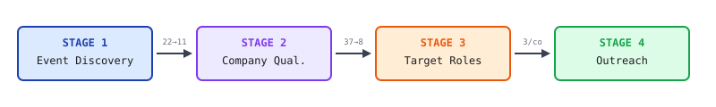
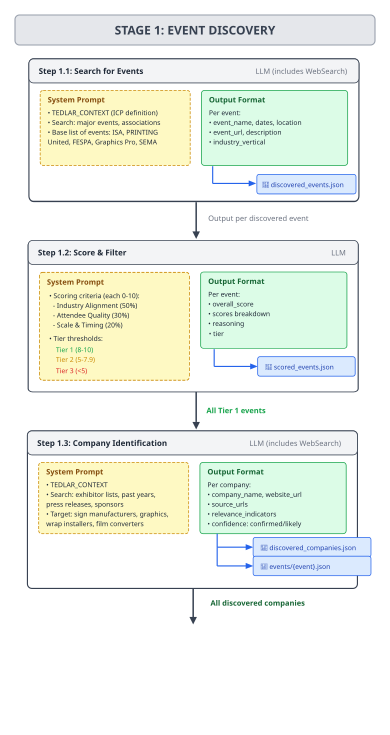
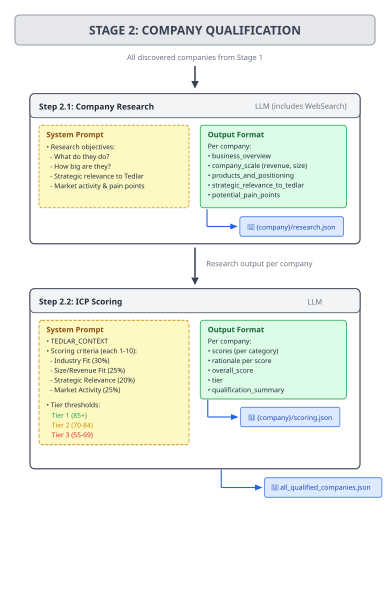
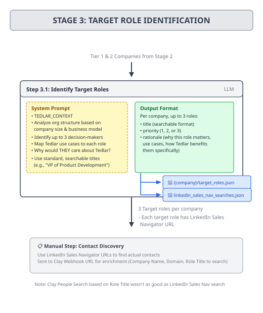
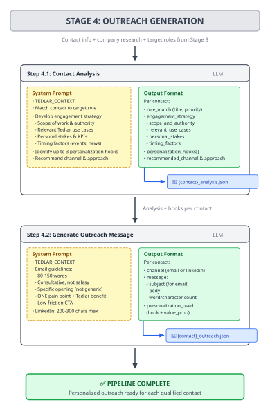

# DuPont Tedlar AI Lead Generation System

## 1. Solution Architecture

A **four-stage AI GTM workflow** that progressively identifies, scores and filters leads:



---

## 2. Data Processing Pipeline

<table>
<tr>
<td></td>
<td></td>
</tr>
</table>

<table>
<tr>
<td></td>
<td></td>
</tr>
</table>

## 3. AI Workflow Orchestration

Pipeline is orchestrated by `main.py` that relies on event triggers with:

1. **Priority order:** Later stages processed first such that companies closer to completion are processed through the pipeline before starting new ones.
2. **Automatic triggers:** Callbacks connect stages (when Stage 2 completes, Stage 3 starts automatically for qualified companies).
3. **Rate limiting:** Shared limiter tracks API tokens (30k/minute) across all stages.
4. **Resume capability:** Each stage produces JSON artifacts, enabling resume from interruption and preventing duplicate reruns.
5. **Tiered qualification**: Scoring thresholds before proceeding to next stage ensures resources focus on high-potential leads. Low-scoring companies filtered early.

---

## 4. Implementation Results

### 4.1 Data Outputs

Each stage produces JSON artifacts stored in `data/`:

```
data/
├── events/
│   ├── discovered_events.json      # 22 raw events from Stage 1.1
│   ├── scored_events.json          # Tiered events from Stage 1.2
│   ├── discovered_companies.json   # 37 companies from Stage 1.3
│   └── companies/
│       └── {EventName}.json        # Companies per event
├── companies/
│   ├── tier_1_high_priority.json   # Summary of top companies
│   ├── all_qualified_companies.json
│   └── {CompanyName}/
│       ├── research.json           # Stage 2.1 deep research
│       ├── scoring.json            # Stage 2.2 ICP scores
│       ├── target_roles.json       # Stage 3 decision-makers
│       └── linkedin_searches.json  # Sales Nav search URLs
└── contacts/
    ├── role_identification_results.json
    ├── linkedin_sales_nav_searches.json
    └── {CompanyName}/
        ├── {ContactName}_analysis.json   # Stage 4.1 hooks/angles
        └── {ContactName}_outreach.json   # Stage 4.2 email draft
```

## 5. Limitations & Future Work

**Current Limitations:**
- Contact discovery requires manual LinkedIn searches (Clay API integration planned but not implemented yet)
- Rate limits require ~60s min. delays between API calls

**Potential Enhancements:**
- Integrate Clay API for automated contact enrichment
- Add email verification step before outreach
- CRM integration for direct lead export